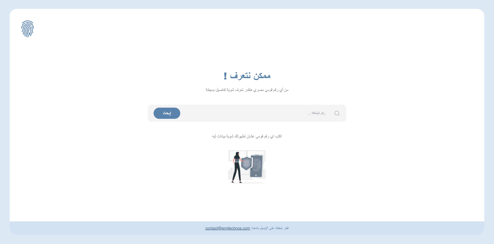

# ID-Info

This website extracts and displays information from Egyptian National ID numbers. It provides users with insights based on the ID, including gender, date of birth, and place of birth.



## Features

- **ID Extraction:** Validates and extracts data from the 14-digit Egyptian National ID number.
- **Gender Detection:** Determines and displays the gender based on the ID number.
- **Birth Date Calculation:** Extracts and displays the date of birth, including day, month, and year.
- **Location Identification:** Maps the ID's location code to a specific governorate or region in Egypt.
- **Responsive Design:** Ensures the website is fully responsive and user-friendly across different devices and screen sizes.

## Technologies Used

- **React:** JavaScript library for building user interfaces.
- **Vite:** Fast build tool and development server.
- **Tailwind CSS:** Utility-first CSS framework for styling.
- **React Icons:** Provides a set of popular icons used in the UI.
- **ESLint:** Tool for identifying and fixing problems in JavaScript code.

## Installation

To run this project locally, follow these steps:

1. **Clone the Repository:**
   ```bash
   git clone https://github.com/ahmedkamal14/ID-Info.git
   cd ID-Info

2. **Install Dependencies:**
   ```bash
    npm install


3. **Run the Development Server:**
   ```bash
    npm run dev

  ## Deployment

  -This project is deployed on GitHub Pages. You can view the live site at: [ID-Info](https://ahmedkamal14.github.io/ID-Info/).
